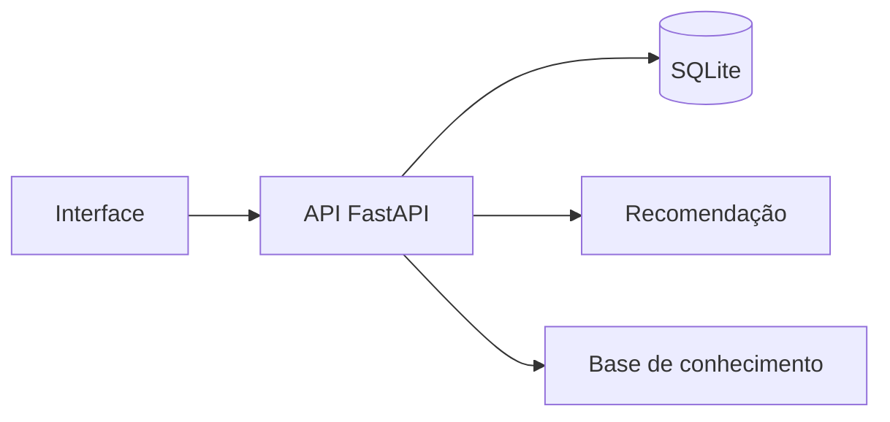

<div align="center">


</div>

<div align="center">

[](#)
[](#)
[](#)

**Protótipo de gestão para salões e clínicas, com agenda, relacionamento com clientes, análises e recursos inteligentes.**

</div>

## Funcionalidades

- Gestão de clientes, serviços e agenda
- Dashboard com indicadores
- Recomendação de serviços
- Assistente para apoio ao atendimento
- Base de conhecimento e recuperação de informações
- API com documentação interativa
- Persistência local com SQLite

## Tecnologias

Python, FastAPI, Streamlit, SQLModel, SQLite, Pandas, scikit-learn, OpenAI SDK e Requests.

## Executar localmente

```bash
python -m venv .venv
# Windows: .venv\Scripts\activate
# Linux/macOS: source .venv/bin/activate
pip install -r requirements.txt
python seed.py
python -m uvicorn app.main:app --reload
```

Em outro terminal:

```bash
python -m streamlit run frontend/streamlit_app.py
```

## Arquitetura



## Observação

Este repositório registra uma versão de desenvolvimento do BeautyFlow AI. Credenciais e integrações externas devem ser configuradas por variáveis de ambiente e nunca adicionadas ao código.

## Autoria

Desenvolvido por **[Geovanna Eduarda da Silva](https://github.com/geovannasilva15)**.
